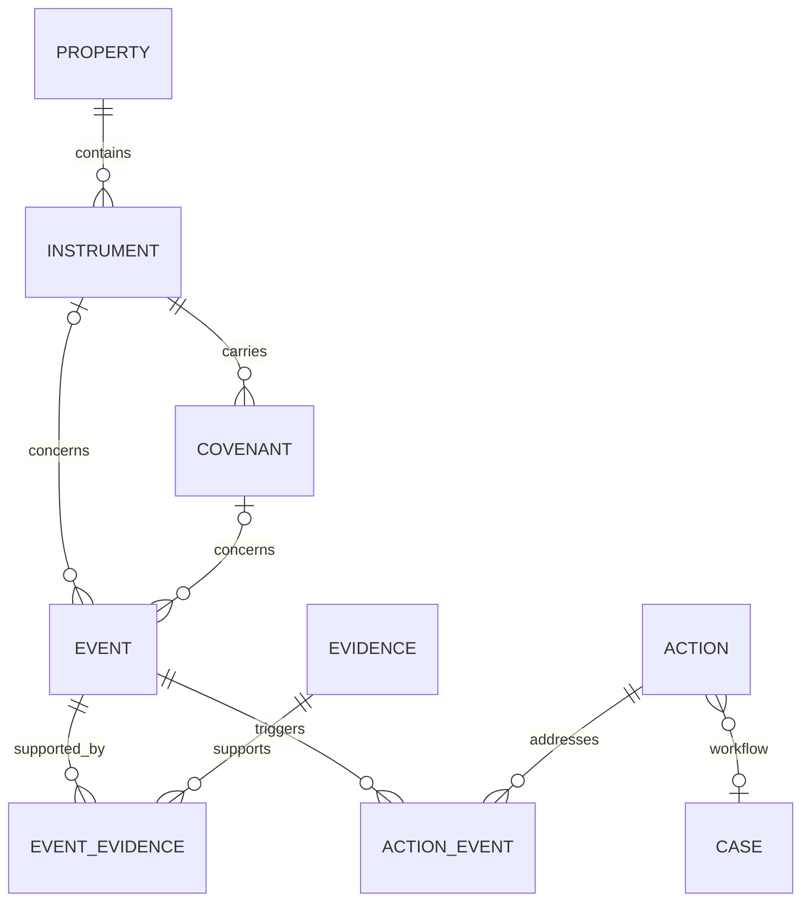

# Instrument model (schema version 2)

The HFA book is represented as properties with separately identified loans,
grants, owned assets and administered contracts. Property totals remain reporting
projections; they do not define instrument identity or merge instrument actions.



## Identity and source boundaries

- Instrument IDs are `kind:source_id`, unique within one agency book. A loan and
  grant sharing source ID `1` are distinct. Reassigning one instrument to two
  properties in the same snapshot is rejected. Separate agencies require separate
  databases; this is not a tenant isolation mechanism.
- Covenant IDs combine instrument ID and obligation type. The current extract
  adapter creates compliance, repayment, affordability, recapture and contract-term
  obligations when their terms are available. Unknown terms stay unknown. These
  categories are not a full legal-clause parser or amendment ledger.
- Servicing events carry explicit instrument IDs. Legacy source ID tags can establish
  that relationship during migration. Public-inventory events without such a link
  remain property scoped, even if the property has only one known loan.
- Event identity combines property, instrument, type, date and program; property
  events additionally retain their distinguishing detail. Scoped source-note edits
  do not create new work items. A changed due date is a distinct occurrence and does
  not silently close the earlier case. Multiple same-type obligations on the same
  instrument/date/program require a future explicit obligation identifier.
- Evidence records preserve source observations, source event IDs, vintage, basis,
  and run input hashes. Multiple sources can support one event. Conflicting status
  observations stop import. Evidence means provenance here, not a verified legal
  document; no document repository or document verification is implied.
- Active agency deadlines produce actions linked to their triggering event. Missing
  dates go to linkage issues. Terminal observations do not generate new actions;
  workflow closure still requires the case review process.
- Dollar principal is stored as integer cents. Missing amounts remain null. Invalid,
  negative, nonfinite or fractional-cent principal values are rejected.

## Outputs and inspection

Every successful pipeline run writes `book_model.json` and includes the same graph
in `result.json.book_model`. `model_*.csv` files export covenants, events, evidence,
their links, actions and linkage issues. JSON is authoritative, including empty
collections. `instruments.csv` retains individual servicing terms and recapture
exposure; `covenants.csv` now contains multiple obligation rows per instrument.

With `operations_db` configured, immutable `model_*` tables enforce snapshot,
property, instrument and covenant relationships with foreign keys. Durable case
state and append-only case audit remain separate from immutable run snapshots.

```sh
python scripts/inspect_instrument.py --db agency.sqlite --run-id RUN_ID --instrument-id loan:LOAN_ID
```

The trace returns that instrument's covenants, events, source evidence and actions
with current case status, assignee and version. It does not imply that unrelated
property events belong to the instrument.

## Existing databases

Opening the database performs a transactional version-2 backfill from saved run
payloads. Existing snapshot tables remain available for compatibility, including
the old `evidence` table which stored event payloads. Use `model_events` and
`model_evidence` for the new semantics.

An existing case is linked only when its property/type/date identifies exactly one
candidate action. Ambiguous historical cases remain intact and are flagged in
`model_linkage_issues`. Migration never guesses which loan a case concerned,
rewrites its approval, or adds fabricated audit decisions. Reopening is idempotent.
Back up operational databases before upgrading; invalid historical identities fail
migration atomically and require source correction.

## Validation boundary

Regression coverage includes same-date actions on different instruments, exact
principal cents, orphan and wrong-property rejection, multiple source observations,
stable case state across runs, immutable snapshots, legacy approval preservation,
and pipeline export/database integration. Real-agency acceptance still requires an
independently reconciled HFA tape and reviewed instrument-level sample cases.
